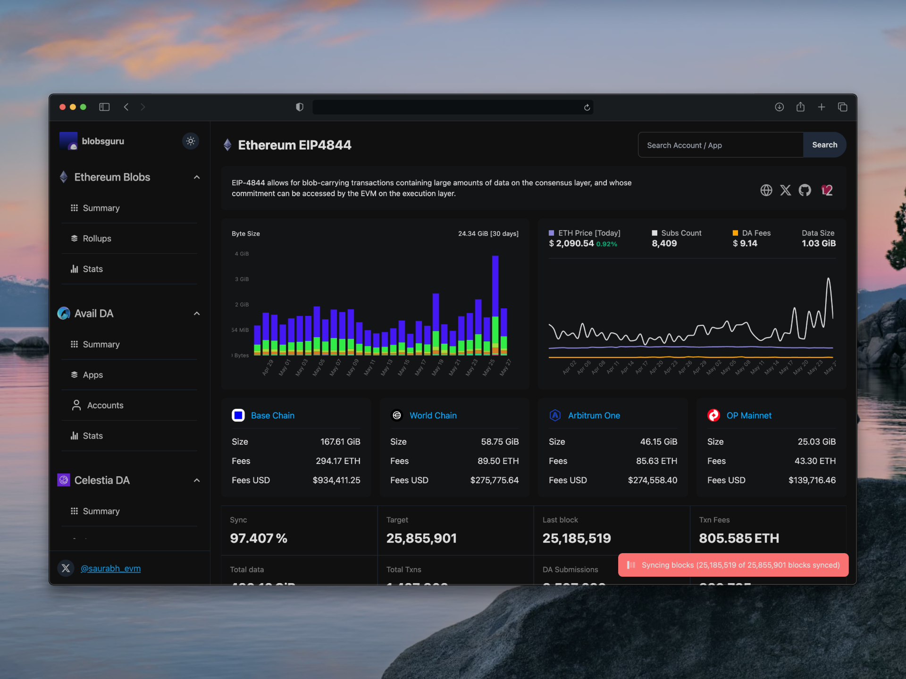

# Blobs Guru

Blobs Guru is a multi-chain data-availability explorer for Ethereum, Avail, and
Celestia. This monorepo contains its web application, the active SubQuery
indexers that power it, and a deprecated Ethereum Substreams implementation
retained for reference.



The active indexers are built with [SubQuery](https://subquery.network/). Use
the SubQuery website as the reference for framework concepts, manifests, and
deployment guidance.

## Applications

| Workspace | Path | Purpose |
| --- | --- | --- |
| `@blobs-guru/web` | `apps/web` | Next.js web application |
| `@blobs-guru/ethereum-subquery` | `apps/ethereum-subquery` | Ethereum SubQuery app |
| `@blobs-guru/avail-subquery` | `apps/avail-subquery` | Avail SubQuery app |
| `@blobs-guru/celestia-subquery` | `apps/celestia-subquery` | Celestia SubQuery app |
| `@blobs-guru/substream-eth-blobs` | `apps/substream-eth-blobs` | Deprecated Ethereum Substreams app |

## Getting started

Install all workspace dependencies from the repository root:

```bash
pnpm install
```

Create local environment files from the committed examples, then review the
public endpoints and fill in the required secrets:

```bash
cp apps/web/.env.example apps/web/.env.local
cp apps/ethereum-subquery/.env.example apps/ethereum-subquery/.env
cp apps/avail-subquery/.env.example apps/avail-subquery/.env
cp apps/celestia-subquery/.env.example apps/celestia-subquery/.env
```

Do not commit the populated environment files.

Run the web application:

```bash
pnpm dev
```

Generate and build every active SubQuery app:

```bash
pnpm codegen:subqueries
pnpm build:subqueries
```

Run an individual indexer and its Docker services:

```bash
pnpm dev:ethereum-subquery
pnpm dev:avail-subquery
pnpm dev:celestia-subquery
```

Each app's own README contains its network-specific configuration and
deployment details. Their source repositories were imported as unsquashed Git
subtrees, so their original commits remain in this repository's commit graph.

Turbo runs the workspace task graph and caches build outputs. The deprecated
Substreams app is excluded from the default `pnpm build`; build it explicitly
with `pnpm build:substream-eth-blobs`.

Shared repository tooling lives at the root: `biome.json` supplies general
formatting and linting, `tsconfig.subquery.json` supplies the common SubQuery
TypeScript baseline, and `.gitignore` covers generated files for every app.
Next-specific ESLint rules and network-specific Docker helpers remain local to
the apps that need them. The root `LICENSE` applies to the monorepo.

## Common commands

| Command | Description |
| --- | --- |
| `pnpm dev` | Start the web application |
| `pnpm build` | Build the web app and all active SubQuery apps with Turbo |
| `pnpm build:web` | Build only the web application |
| `pnpm build:subqueries` | Build all active SubQuery apps |
| `pnpm codegen:subqueries` | Generate types for all active SubQuery apps |
| `pnpm build:substream-eth-blobs` | Build the deprecated Substreams app |
| `pnpm check-types` | Type-check the web application |
| `pnpm check:biome` | Check shared configuration with Biome |
| `pnpm format` | Format supported files with Biome |
| `pnpm test:subqueries` | Run all SubQuery test commands |
